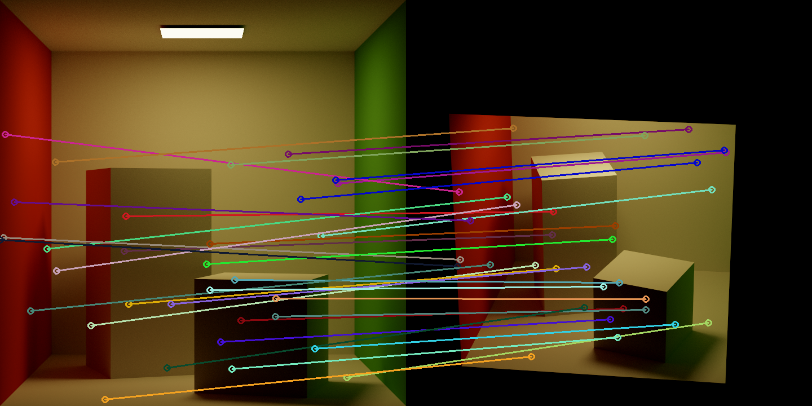
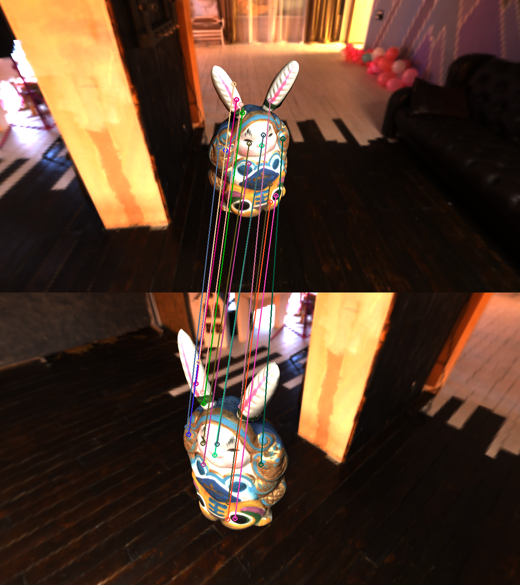

# MultiviewCorrespondence

This project is based on [Asuna](https://github.com/f1shel/Asuna), commit id `b80e9e3f86ab9f27babe394955becba77c84868b`.

Scene description file is quite similar with Asuna, except that some parts (e.g. material, textures, lights) are ignored when loading and parsing json. The most important change is that now you need to specify pair (reference view and source view) in the scene description file, like this:

```json
"shots": [
    view0, view1, view2
], "pairs": [
    {"ref": 0, "src": 1},
    {"ref": 0, "src": 2}
]
```

The output of this project is a "flow" image of high dynamic range (.exr) of which R channel stores X offset, G channel stores Y offset and B channel stores visibility. Assume that "flow" image is denoted by I, pixel in reference view is Pr and its corresponding pixel in source view is Ps, we have:

+ `I(Pr).b == 0`: Pr is invisible in source view
+ `I(Pr).b == 1`: Pr is visible in source view
  + Ps.x = Pr.x + I(Pr).r
  + Ps.y = Pr.y + I(Pr).g

Example visualization program is under demo folder.

## Result

<div>
<center>

</center>
</div>

<div>
<center>

</center>
</div>

## Todo

- [ ] Add camera from OpenCV extrinsic and intrinsic parameter
